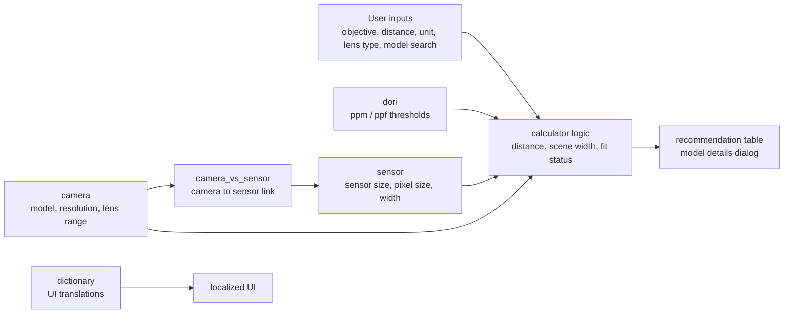
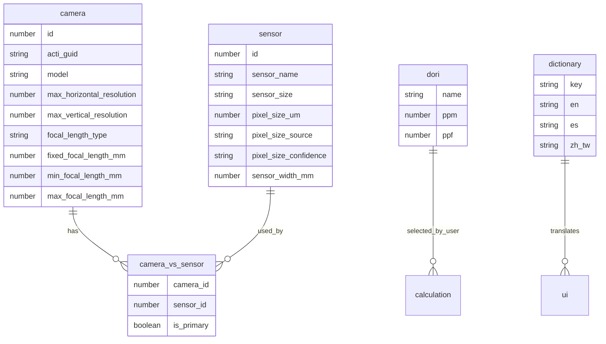

# Lens Calculator Schema

This document explains the temporary database used by the Lens Calculator prototype and how the UI connects the data.

## Data Flow



## Entity Relationship Overview



## Tables

### `camera`

Stores camera model and lens information used for recommendations.

Important fields:

- `id` - local temporary camera ID
- `acti_guid` - ACTi source model GUID
- `model` - display model name
- `max_horizontal_resolution` - horizontal pixel count used in calculations
- `max_vertical_resolution` - vertical pixel count
- `focal_length_type` - `fixed` or `variable`
- `fixed_focal_length_mm` - fixed focal length, if applicable
- `min_focal_length_mm` - minimum focal length for calculation
- `max_focal_length_mm` - maximum focal length for calculation
- `focal_length_raw` - original source text
- `max_frame_rate_vs_resolution` - original resolution/frame-rate source text

### `sensor`

Stores sensor dimensions and pixel size values.

Important fields:

- `id` - local temporary sensor ID
- `sensor_name` - combined sensor label
- `sensor_size` - source sensor format, such as `1/2.7"`
- `sensor_format` - normalized format
- `estimated_active_width_mm` - estimated active sensor width
- `estimated_active_height_mm` - estimated active sensor height
- `pixel_size_um` - estimated pixel size in micrometers
- `pixel_size_source` - marks how pixel size was derived
- `pixel_size_confidence` - currently `temporary`
- `sensor_width_mm` - width used in the calculator

Temporary note:

The current database estimates pixel size from sensor format and horizontal resolution. The official database should replace `pixel_size_um` and `sensor_width_mm` when available.

### `camera_vs_sensor`

Join table between cameras and sensors.

Important fields:

- `camera_id` - links to `camera.id`
- `sensor_id` - links to `sensor.id`
- `is_primary` - marks the primary sensor relationship
- `notes` - source note

### `dori`

Stores DORI thresholds.

| Name | ppm | ppf |
|---|---:|---:|
| Detection | 25 | 8 |
| Observation | 62 | 19 |
| Recognition | 125 | 38 |
| Identification | 250 | 76 |

When the user selects meters, `ppm` is shown as the primary value. When the user selects feet, `ppf` is shown as the primary value.

### `dictionary`

Stores multilingual UI text.

Fields:

- `key` - stable UI string key
- `en` - English
- `es` - Spanish
- `zh_tw` - Traditional Chinese

The language switcher stores the user choice in a cookie/localStorage key:

```text
lens_calculator_language
```

## Calculation Logic

The prototype uses the same core formula pattern from the specification workbook.

### Sensor Width

```text
sensor_width_mm = horizontal_resolution * pixel_size_um / 1000
```

In the temporary database, `sensor_width_mm` is derived from estimated active sensor dimensions.

### Maximum DORI Distance

```text
max_distance =
  unit_factor
  * max_focal_length_mm
  * horizontal_pixels
  / ppm
  / sensor_width_mm
```

Where:

- `unit_factor = 1` for meters
- `unit_factor = 3.280839895` for feet
- `ppm` comes from the selected DORI level

### Needed Focal Length

```text
needed_focal_mm =
  target_distance
  * ppm
  * sensor_width_mm
  / unit_factor
  / horizontal_pixels
```

For zoom lenses, if the needed focal length is inside the lens range, the UI shows that as the recommended focal length. Otherwise it clamps to the nearest available focal length.

### Scene Width

```text
scene_width =
  target_distance
  * sensor_width_mm
  / recommended_focal_mm
```

### Fit Status

```text
ratio = max_distance / target_distance
```

Current prototype thresholds:

- `Suitable` when `ratio >= 1`
- `Borderline` when `0.85 <= ratio < 1`
- `Not suitable` when `ratio < 0.85`

## Future Official Database Integration

When the official ACTi database is available, the prototype should map official tables into the same logical data shape:

- official camera/product data -> `camera`
- official sensor/component data -> `sensor`
- official camera-sensor relationship -> `camera_vs_sensor`
- official translation dictionary -> `dictionary`

The UI should not need major changes if these table contracts remain stable.
